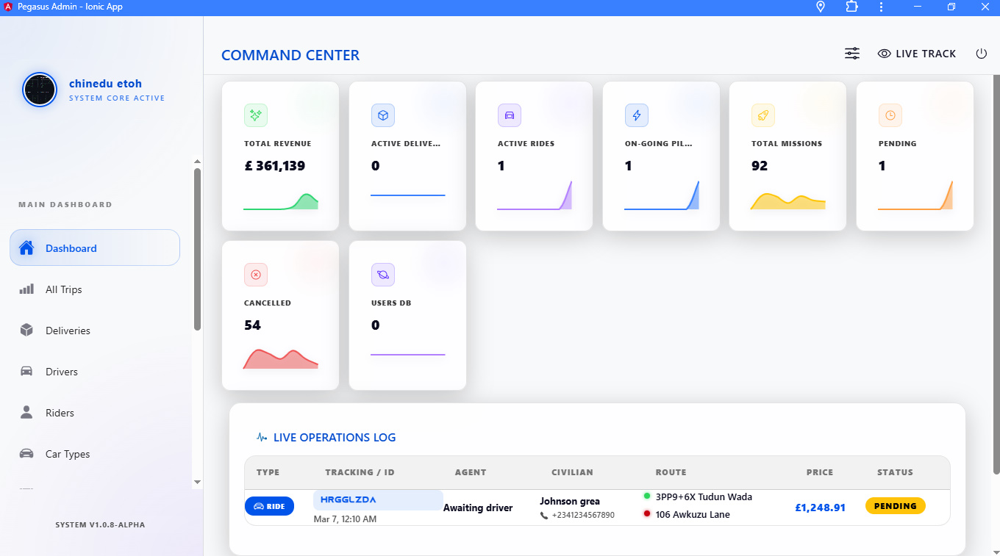

  

<h1 align="center">🚕 Ride-Share Pro: The Ultimate Ionic 8 Uber Clone</h1>

  <strong>Dual-Service: Ride-Sharing & Package Delivery  •  3 Apps in 1  •  Production-Ready</strong>

  
  
  
  

  

---

## 📺 Video Walkthrough

---

## 🎮 Try Before You Buy (Live Demos)
Experience the speed and elegance of all 3 apps right in your browser. These are high-performance PWAs!

  

  

  

---

## 🔥 Why Ride-Share Pro?

Stop wasting time on outdated templates. **Ride-Share Pro** is built with the future in mind, using a stunning **Glassmorphism UI** that will make your app stand out in any market.

| Feature | Competitors | ✅ Ride-Share Pro |
|---|---|---|
| **Design** | Generic / Dated | **Premium Glassmorphism** |
| **Framework** | Ionic 4–6 (Legacy) | **Ionic 8** (Latest) |
| **Architecture** | Monolithic | **Modular Standalone Components** |
| **Business Model** | Single Service | **Dual Service (Rides + Logistics)** |
| **Ready for Stores** | Often fails review | **Fully Compliant & Scalable** |

---

## 📸 Visual Showcase

### 🧑‍💼 Rider App — _The Ultimate Customer Experience_
A high-performance, beautiful UI designed for conversions. Featuring smart booking, real-time tracking, and integrated logistics.

 
 
 
 

 
 
 
 

 
 
 
 

 
 
 
 

 
 
 
 

 
 
 
 

### 🚗 Driver App — _Optimized for Earnings_
Simple, intuitive, and feature-rich. Drivers get everything they need to manage their business in real-time.

 
 
 

 
 
 

 
 
 

 
 
 

### 🖥️ Admin Panel — _The Global Command & Control Center_
A desktop-first dashboard for complete operational visibility. Manage users, monitor finances, and customize app content instantly.

 
 

 
 

 
 

 
 

 
 

 
 

 

---

## ⚡ Key Features

- 📍 **Real-time Tracking**: Powered by Firebase Realtime Database.
- 💳 **Global Payments**: Stripe & PayPal integrated.
- 📦 **Package Delivery**: Built-in support for logistics and courier services.
- 🔔 **OneSignal Push**: Stay connected with drivers and riders instantly.
- 🌍 **Multi-Locale**: Ready for international expansion with 240+ country support.
- 📈 **Earnings Analytics**: Detailed charts for drivers and admins.

---

## 📞 Get Started

Ready to launch your own ride-sharing empire? Grab the source code today or reach out for custom integration services.

  

  Built with ❤️ using Ionic 8 • Angular 18 • Capacitor 6

