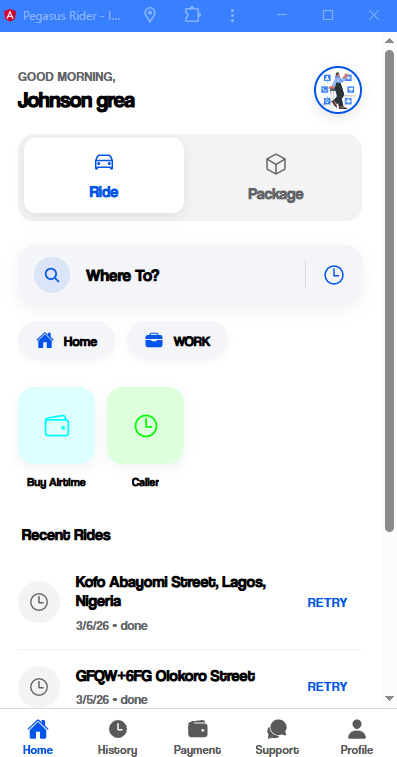
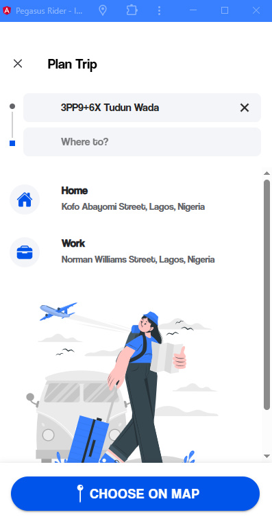
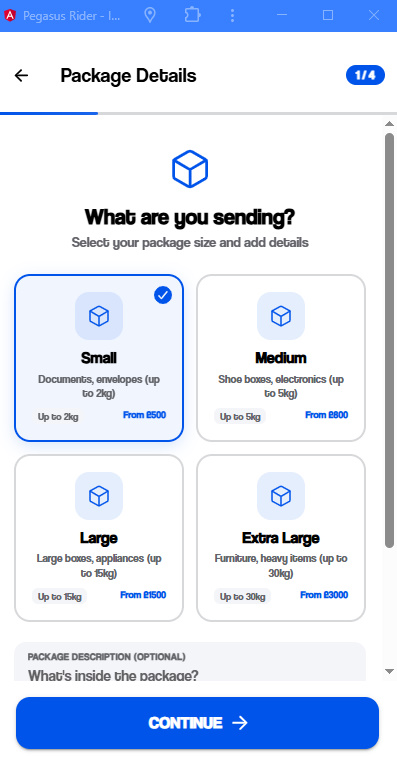
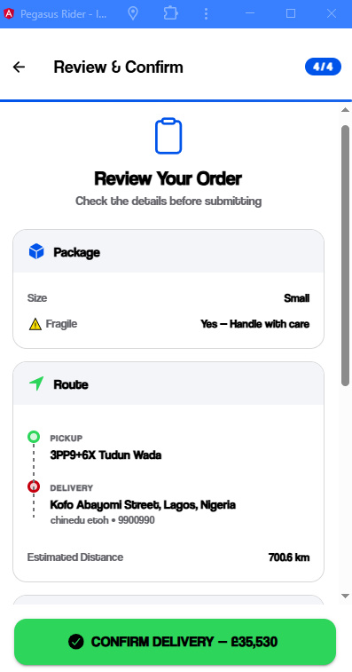
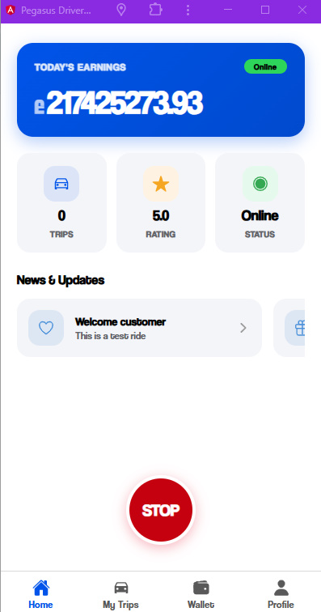
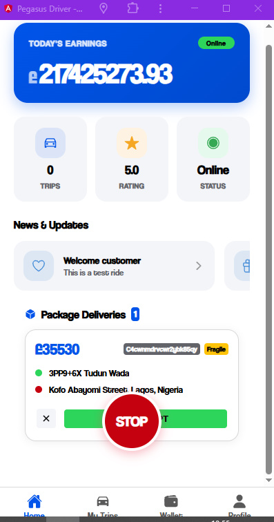
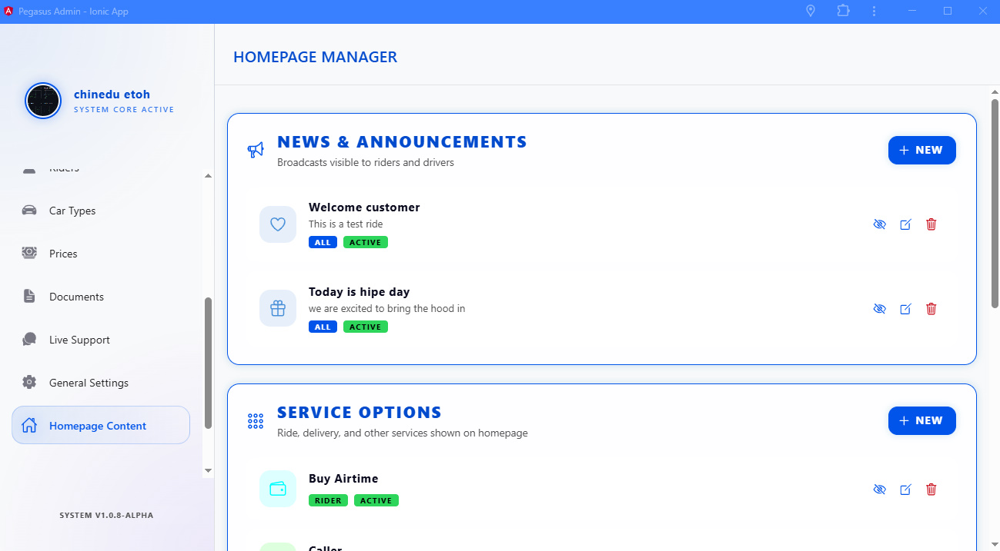
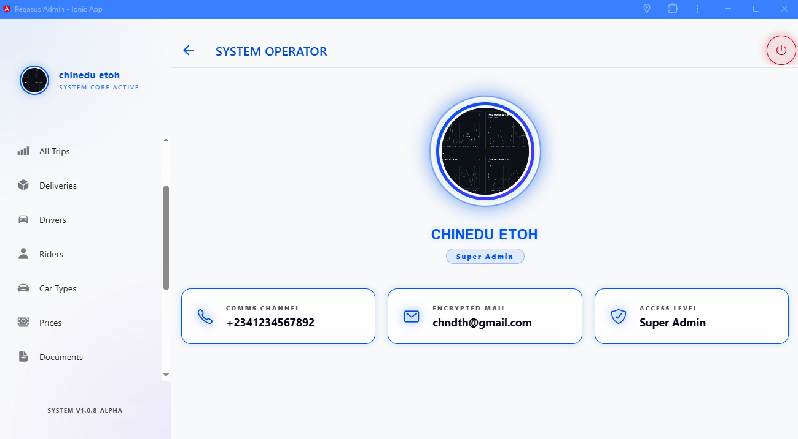

  

<h1 align="center">🚕 Ride-Share Pro: The Ultimate Ionic 8 Uber Clone</h1>

  <strong>Dual-Service: Ride-Sharing & Package Delivery  •  3 Apps in 1  •  Production-Ready</strong>

  
  
  
  

  

---

## 📺 Video Walkthrough

---

## 🎮 Try Before You Buy (Live Demos)
Experience the speed and elegance of all 3 apps right in your browser. These are high-performance PWAs!

  

  

  

---

## 🔥 Why Ride-Share Pro?

Stop wasting time on outdated templates. **Ride-Share Pro** is built with the future in mind, using a stunning **Glassmorphism UI** that will make your app stand out in any market.

| Feature | Competitors | ✅ Ride-Share Pro |
|---|---|---|
| **Design** | Generic / Dated | **Premium Glassmorphism** |
| **Framework** | Ionic 4–6 (Legacy) | **Ionic 8** (Latest) |
| **Architecture** | Monolithic | **Modular Standalone Components** |
| **Business Model** | Single Service | **Dual Service (Rides + Logistics)** |
| **Ready for Stores** | Often fails review | **Fully Compliant & Scalable** |

---

## � Visual Showcase

### 🧑‍💼 Rider App — _Elegance in Motion_
Deliver a world-class experience to your customers. From pinpoint map accuracy to seamless package delivery flows.

 
 
 
 

### 🚗 Driver App — _Power in the Pocket_
Maximize your fleet's efficiency with a dashboard that shows everything from earnings to turn-by-turn navigation at a glance.

 
 

### 🖥️ Admin Panel — _The Command Center_
Monitor your entire business from a single desktop dashboard. Manage users, track live rides, and adjust prices in real-time.

 

 
 

---

## ⚡ Key Features

- � **Real-time Tracking**: Powered by Firebase Realtime Database.
- � **Global Payments**: Stripe & PayPal integrated.
- � **Package Delivery**: Built-in support for logistics and courier services.
- � **OneSignal Push**: Stay connected with drivers and riders instantly.
- � **Multi-Locale**: Ready for international expansion with 240+ country support.
- � **Earnings Analytics**: Detailed charts for drivers and admins.

---

## � Get Started

Ready to launch your own ride-sharing empire? Grab the source code today or reach out for custom integration services.

  

  Built with ❤️ using Ionic 8 • Angular 18 • Capacitor 6

